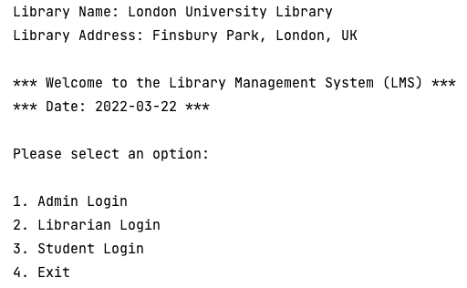
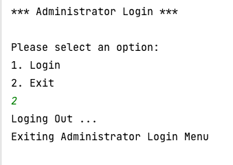
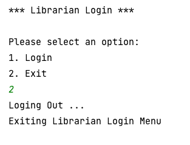
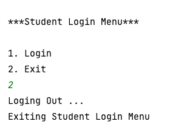

# Library Management System Project

This project is a library management system, developed using Java 8,
as a console based application.

## Installing:

1. Clone the repo

```
https://github.com/AAdewunmi/OnlineLibraryManagementSystem.git
```

2. Open Project Folder


3. Explore (or run) the project. Main class is `library/LibraryMain.java`.

Enjoy 😎

## LogIn

1. Administrator:

    1.1. Login as admin (username: "admin", password: "admin")
    
    1.2. Add / delete / print list of users

    1.3. Logout
    
2. Librarian:

    2.1. Login as librarian (username: ADMINISTRATOR DEFINED, password: ADMINISTRATOR DEFINED)

    2.2. Add / delete / search for books
   
    2.3. Logout
    
3. Student:

    3.1. Login as student (username: ADMINISTRATOR DEFINED, password: ADMINISTRATOR DEFINED)
    
    3.2. Search / reserve books / borrow books
    
    3.3. Logout

NOTE: You may need to press ENTER more than once after each command to continue,
when taking input from the command line. 

### Here are screenshots of the application:
#### 1. Main Menu 




#### 2. Administrator Login




#### 3. Librarian Login




#### 4. Student Login




### Contributing
Pull requests are welcome. For major changes, please open an issue first to discuss what you would like to change.

👇 👇 👇

Future plans:

1. Unit testing -> add unit testing for all the features.
2. Add a main GUI
3. Add a GUI for the librarian
4. Add a GUI for the student
5. Add a database to store the users / books
